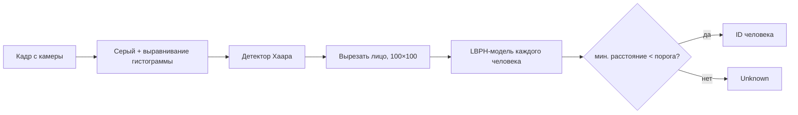

# FaceRecognizer

Распознавание лиц с веб-камеры в реальном времени на C++20 и OpenCV: детектор Хаара находит лицо, модель LBPH определяет, чьё оно.


<!-- demo: перетащите GIF в редактор README на GitHub — он загрузится в user-attachments, а не в репозиторий -->

## Возможности

- **Добавление человека** по числовому ID: программа делает серию снимков лица с камеры и обучает модель.
- **Дообучение** существующей модели новыми снимками (например, при другом освещении) без потери старых данных.
- **Распознавание в реальном времени**: над каждым лицом выводится `ID n (расстояние)` или `Unknown`.
- **CLI и интерактивное меню**: команды для скриптов, меню — при запуске без аргументов.
- **Кроссплатформенная сборка** через CMake: Linux, macOS, Windows.

## Как это работает



**LBPH** (Local Binary Patterns Histograms) описывает лицо набором гистограмм локальных текстур.
При распознавании лицо сравнивается с моделью каждого человека, и выбирается ближайшая.
`predict` возвращает **расстояние**, а не уверенность: чем оно меньше, тем больше сходство.
Если расстояние до ближайшей модели не меньше порога (`--threshold`, по умолчанию 50), лицо считается незнакомым.

Одинаковая предобработка (серый цвет, выравнивание гистограммы, размер 100×100) используется и при обучении,
и при распознавании. Снимки при обучении делаются с паузой 200 мс, чтобы они отличались друг от друга.
Если в кадре несколько лиц, берётся самое крупное.

## Сборка

Нужны компилятор с поддержкой C++20, CMake ≥ 3.16 и OpenCV 4.x с модулем `face` из opencv_contrib.

### Ubuntu / Debian

```bash
sudo apt install cmake g++ libopencv-dev   # libopencv-dev уже включает модули contrib
cmake -S . -B build -DCMAKE_BUILD_TYPE=Release
cmake --build build -j
```

### macOS

```bash
brew install cmake opencv   # формула opencv собрана вместе с contrib
cmake -S . -B build -DCMAKE_BUILD_TYPE=Release
cmake --build build -j
```

### Windows

Через [vcpkg](https://github.com/microsoft/vcpkg):

```powershell
vcpkg install opencv4[contrib]:x64-windows
cmake -S . -B build -DCMAKE_TOOLCHAIN_FILE=<путь к vcpkg>/scripts/buildsystems/vcpkg.cmake
cmake --build build --config Release
```

Можно также открыть папку проекта в Visual Studio 2022 (**File → Open → Folder**): она сама подхватит `CMakeLists.txt`.

После сборки рядом с программой копируется каталог `data/` с каскадом Хаара, поэтому запускать её можно из любого места.

## Использование

```bash
./build/facerec enroll --id 1      # добавить человека с ID 1 (20 снимков, Esc — отмена)
./build/facerec update --id 1      # дообучить его модель новыми снимками
./build/facerec recognize          # распознавание с камеры (Esc или q — выход)
./build/facerec list               # список сохранённых моделей
./build/facerec                    # интерактивное меню
./build/facerec --help             # все параметры
```

| Параметр | По умолчанию | Назначение |
|---|---|---|
| `--id N` | — | ID человека, обязателен для `enroll` и `update` |
| `--samples N` | `20` | сколько снимков сделать при обучении |
| `--camera N` | `0` | номер камеры |
| `--threshold T` | `50` | порог расстояния LBPH: меньше — строже |
| `--models-dir DIR` | `./FaceModels` | где хранить модели |
| `--cascade FILE` | ищется автоматически | путь к `haarcascade_frontalface_default.xml` |

Каскад ищется так: `--cascade` → переменная окружения `FACEREC_CASCADE` → `data/` рядом с программой →
`data/` в текущем каталоге → `data/` в исходниках → данные самой OpenCV.

Модели хранятся в файлах `FaceModels/face_model_ID_<id>.xml`, по одному на человека.

Коды возврата: `0` — успех, `1` — неверные аргументы, `2` — ошибка камеры или файлов.

## Структура проекта

```
include/facerec/     заголовки
src/
  main.cpp           разбор команды и меню
  config.cpp         параметры CLI и поиск каскада
  camera.cpp         камера и окно предпросмотра (RAII)
  face_detector.cpp  детектор Хаара
  preprocess.cpp     предобработка лица
  model_store.cpp    чтение, запись и список моделей
  enroller.cpp       съёмка снимков и обучение
  recognizer.cpp     распознавание и отрисовка результата
data/haarcascades/   каскад Хаара из OpenCV
```

## Ограничения

- Детектор Хаара и LBPH чувствительны к освещению и повороту головы: лучше обучать модель при том же свете,
  при котором она будет работать, и дообучать её командой `update`.
- Порог `--threshold` зависит от камеры и условий съёмки, его стоит подобрать под себя.
- Модели лиц — это биометрические данные. Они хранятся локально и не шифруются; `FaceModels/` добавлен в `.gitignore`.

## Что можно улучшить

- Имена людей вместо числовых ID.
- Распознавание по фото и видеофайлу, а не только с камеры.
- Нейросетевые детектор и распознаватель (YuNet + SFace из OpenCV) — заметно точнее Хаара и LBPH.
- Юнит-тесты и подбор порога на наборе фотографий.
